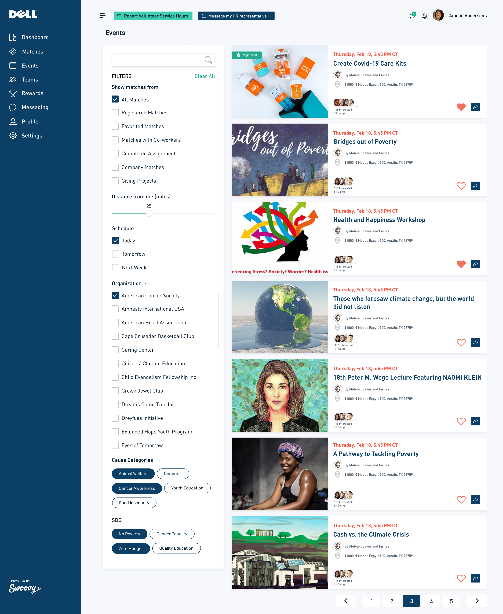
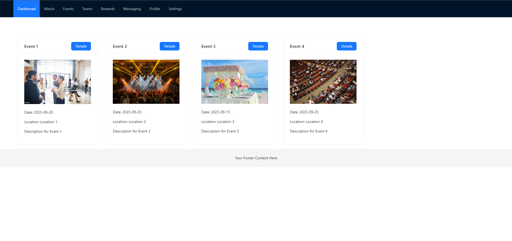

# Ant-design-event-page 

## Description
Your task is to create a responsive event page using Ant Design and Ant Design Pro. This page should display a list of events in a card-based layout, allowing users to view event details.

## Table of Contents

- [Installation](#installation)
- [Requirements](#requirements)
- [Example](#example)
- [Contributors](#contributors)
- [Questions](#questions)

## Installation

First go to the right directory: 

### `cd ant-design-event-page`

If you first time run it you need to install packages:

### `npm install`

In the project directory, you can run:

### `npm start`

Runs the app in the development mode.\
Open [http://localhost:3000](http://localhost:3000) to view it in your browser.

The page will reload when you make changes.\
You may also see any lint errors in the console.

## Requirements

1. **Setup:** Create a new React application using Ant Design Pro as the base framework. You can use `create-umi` or any other preferred method for setting up your project.
2. **Event Data:** Mock event data should be included in your project. Use any JSON structure of your choice for this data. Each event should have at least the following properties: `title`, `date`, `location`, `description`, and `image` (URL).
3. **Card Layout:** Implement a card-based layout to display events. Each event should be represented as a card. You are free to design the card layout as per your creativity but should use Ant Design components for structuring and styling.
4. **Responsive Design:** Ensure that your page is responsive and looks good on both desktop and mobile devices.

## Example

## Contributors

:octocat: [Kenny Zhang](https://github.com/KennyZhang12138)

## Questions

For additional questions, contact me at the email provided below.

- GitHub: [Ant-design-event-page ](https://github.com/KennyZhang12138/ant-design-event-page/tree/main)